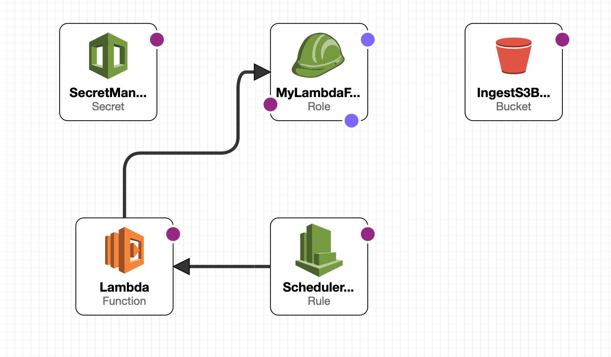

- [AWS-Lambda-API-Ingestion](#aws-lambda-api-ingestion)
    - [function.py](#functionpy)
    - [stack.yml](#stackyml)
        - [Hardcorded Values ](#hardcorded-values-)
      - [Parameters for cloudFormation Template](#parameters-for-cloudformation-template)
    - [workflows/main.yml](#workflowsmainyml)
      - [Usage of main.yml](#usage-of-mainyml)

# AWS-Lambda-API-Ingestion
This Repository demonstrates ingestion of any API in AWS and trigger the Lambda Function

### function.py
Python function retrives the secrets stored in the secretManager for the weather API 
Checks if there is a existing file for today, if so appends data or else created new file 

### stack.yml
The cloudFormation to create resources and schedule the ingestion  
##### Hardcorded Values  
1. BucketName (Just to ensure that the bucket is not globally used)
2. Schedule Job (scheduled to run every one hour)
3. SecretName 
4. FunctionName
5. LambdaHandler

`Note`: Make sure that names of the resources are unique and not taken globally or you can just add
your accountid as prefix (just a suggestion)

#### Parameters for cloudFormation Template
1. api key which has to be stored

### workflows/main.yml
This is a continious deployment, to push the function.py to specified lambda function  
The workflow is triggered only when the there is a commit to the main branch

#### Usage of main.yml
To run the main.yml to deploy your code to your respective lambda fucntion
1. The function should exists
2. Your AWS access keys should be stored in the git secrets

